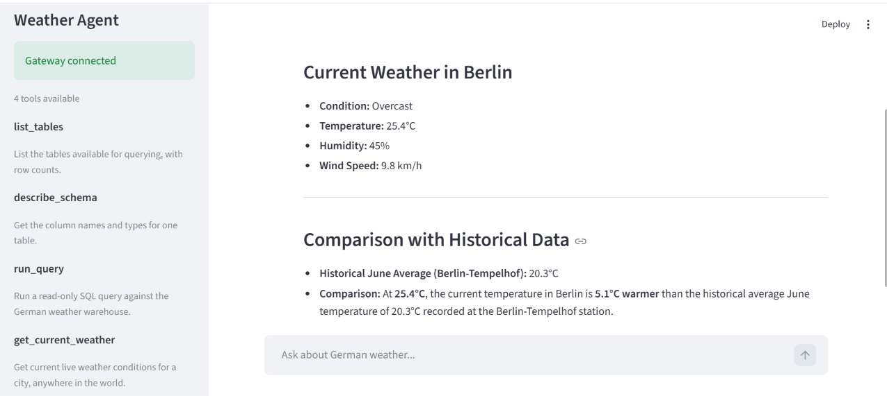
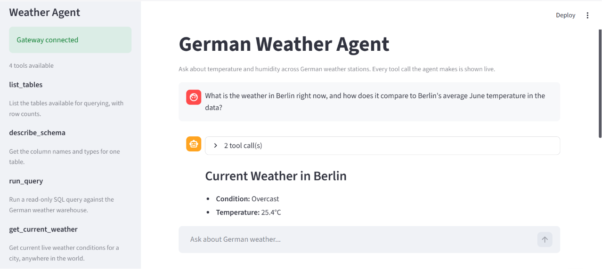
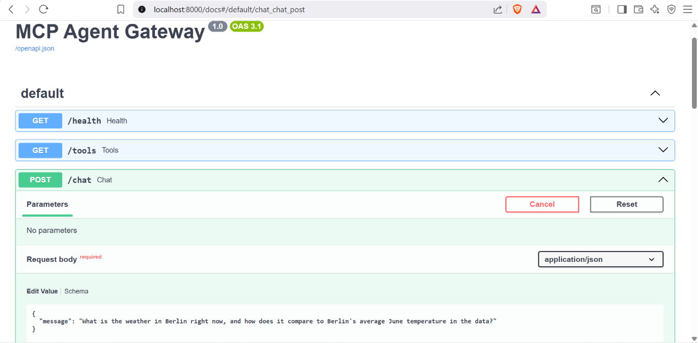
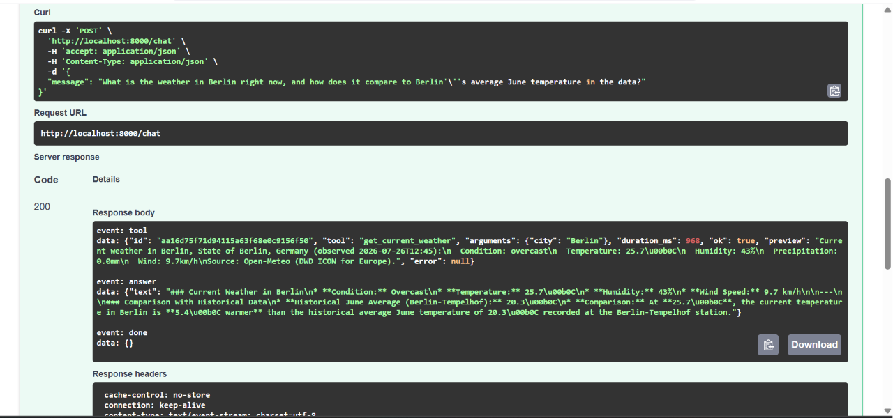

# MCP Multi-Tool AI Assistant

[](https://github.com/suhasnu/MCP_Agent_Multi_tool_AI_Assistent/actions/workflows/ci.yml)


An LLM agent that answers questions about German weather by **writing its own SQL** against a data warehouse it queries live and combines that with real-time conditions from a public API in a single answer.

Most Model Context Protocol demos are a chat box wired to someone else's API. This one has two halves that meet in the middle: a full ETL pipeline that turns raw weather-service archives into a queryable warehouse, and an agent that queries it. The join between them is *measured*, not assumed.



> **Asked:** *"What is the weather in Berlin right now, and how does it compare to Berlin's average June temperature in the data?"*
> The agent calls a live weather API **and** writes SQL against the historical warehouse, then answers from both, noting that current conditions are 5.1 °C warmer than the June average recorded at the Berlin-Tempelhof station.

Every tool call is shown live in the interface, with its arguments and latency:



## What it does

- **Generates SQL from natural language** against a DuckDB warehouse of German weather observations.
- **Fetches live weather worldwide** via Open-Meteo (no API key) and reasons across live + historical data in one response.
- **Shows its work** every tool call, with arguments and latency, streams to the interface as it happens.
- **Measures itself** an evaluation harness scores tool selection and SQL accuracy across graded scenarios.

## Architecture

```
BUILD PATH  (offline, scheduled via GitHub Actions)
  ┌─────────────┐   ┌──────────────────────────────┐   ┌───────────────┐
  │ DWD station │──▶│  ETL pipeline                │──▶│  quality gate │
  │  archives   │   │  ingest → bronze → silver →  │   │  (14 checks)  │
  └─────────────┘   │  gold                        │   └───────┬───────┘
                    └──────────────────────────────┘           │ pass
                                                                ▼
                                                        ┌───────────────┐
                                                        │    DuckDB     │
                                                        │   warehouse   │
                                                        └───────┬───────┘
                                                                │
  SERVE PATH  (real time)                                       │ reads
  ┌──────────┐   ┌───────────────┐   ┌──────────────┐   ┌───────▼──────────┐
  │  User /  │──▶│  FastAPI      │──▶│  MCP agent   │──▶│ analytics server │
  │ Streamlit│◀──│  gateway      │◀──│ Gemini/Groq  │   │  read-only SQL   │
  │    UI    │   │  (HTTP + SSE) │   └──────┬───────┘   └──────────────────┘
  └──────────┘   └───────────────┘          │
                                            │  ┌──────────────────┐   ┌─────────────┐
                                            └─▶│ live-weather srv │──▶│ Open-Meteo  │
                                               │   (worldwide)    │   │     API     │
                                               └──────────────────┘   └─────────────┘
```

- **Data pipeline** Deutscher Wetterdienst (DWD) station archives are ingested through a medallion architecture: `bronze` lands raw text with provenance, `silver` types and cleans it, `gold` aggregates it. A 14-check quality gate fails the build on bad data.
- **MCP servers** the agent reaches the warehouse through a custom [Model Context Protocol](https://modelcontextprotocol.io) server that enforces read-only SQL at the DuckDB engine, not by string matching. A second MCP server provides worldwide live weather.
- **Gateway** a FastAPI service owns the agent and streams tool events and the answer over Server-Sent Events. The Streamlit UI is a thin client holding no agent state.
- **Provider-agnostic** the model layer switches between Google Gemini and Groq with one environment variable.

The gateway's auto-generated OpenAPI docs, and the raw SSE stream a request produces:





## Quickstart

```bash
git clone https://github.com/suhasnu/MCP_Agent_Multi_tool_AI_Assistent.git
cd MCP_Agent_Multi_tool_AI_Assistent
python -m venv .venv
.venv\Scripts\activate            # Windows  (use: source .venv/bin/activate on macOS/Linux)
pip install -r requirements.txt

copy .env.example .env            # then add a free Gemini key from aistudio.google.com

# Build the warehouse (downloads a subset of DWD stations)
python -m pipeline.run --stations 5
python -m pipeline.bronze
python -m pipeline.silver
python -m pipeline.gold
python -m pipeline.quality

# Run it (two terminals)
uvicorn gateway.main:app          # terminal 1: the agent, behind HTTP
streamlit run ui/app.py           # terminal 2: the UI
```

UI at http://localhost:8501, interactive API docs at http://localhost:8000/docs.

## The data pipeline

| Layer | What it holds | Key decision |
|---|---|---|
| bronze | Raw station rows as delivered, plus `source_file` and `ingested_at` | Everything is text, so a parsing fix re-runs silver instead of re-downloading |
| silver | Typed, cleaned readings with station metadata joined | `-999` sentinels become NULL; a LEFT JOIN keeps unmatched readings instead of dropping them |
| gold | Daily and monthly aggregates per station and per federal state | Bundesland averages are computed from silver, not from station averages, so a station with 40 readings isn't weighted like one with 700 |

Downloads are ETag-cached, so a re-run re-checks every station but downloads only what changed.

## Evaluation

`python -m evals.run` scores 17 scenarios on two metrics:

- **Tool-selection accuracy**  did the agent reach for the right tool? (~94%)
- **SQL execution accuracy**  does the generated query return the same rows as a hand-written gold query? (the Spider/BIRD result-set metric)

Scenarios are graded easy/medium/hard, and results are cached by prompt hash to respect free-tier rate limits.

The harness earned its keep. The first run scored 33% exact-match, but reading the failures showed most were the model returning a *correct* answer with an extra column, alongside a prompt bug that copied `LIMIT 50` into queries. That led to adding a containment metric and fixing the prompt exactly the kind of diagnosis the harness exists to enable. On hard, multi-step queries the dominant limit is model consistency rather than prompt quality, and the harness separates those genuine errors from over-strict scoring cleanly.

## Testing

98 test functions (114 cases with parametrization), with no network or API keys required external HTTP is mocked and the agent is faked, so the suite runs anywhere. CI runs the suite and `ruff` on every push via GitHub Actions.

```bash
pytest -q
```

## Stack

Python 3.12 · DuckDB · FastAPI · Streamlit · LangChain · Model Context Protocol · Gemini / Groq · pytest · ruff · GitHub Actions

## Data & attribution

Historical data: [Deutscher Wetterdienst Climate Data Center](https://opendata.dwd.de/climate_environment/CDC/), used under its [terms of use](https://opendata.dwd.de/climate_environment/CDC/Terms_of_use.pdf).
Live weather: [Open-Meteo](https://open-meteo.com/), CC BY 4.0.

## License

MIT
